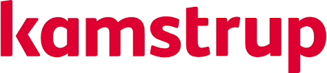

```{r setup, include=FALSE}
knitr::opts_chunk$set(echo = FALSE)
```

## Purpose of Rhus useR groups {.smaller}

An informal group for meeting and **discussing** current trends and experiences in R.

**Who is this for?** 
Everybody interested in `R`, but introductory material is covered by AU-CRU.

**Which subjects are covered in the meetings?** Primarily topics for advanced users, e.g.

- `R`/Shiny and current trends
- Reproducible research
- Innovative ways of data visualisation or promoting data awareness
- Implementing machine learning and artificial intelligence in industry
- Networking with other R users in and around Aarhus

## | Purpose of Rhus useR groups  {.smaller}

**Who is running the group?** 
Voluntary contributors. Notable mentions:

- Max Odsbjerg Pedersen (Kgl. Bibliotek)
- Luke Johnston (Postdoc, Department of Public Health)
- Stefan McKinnon Høj-Edwards (Kamstrup A/S) <== Me


## Code of Conduct

TL;DR: **Be nice**, by

- providing a welcoming and supportive environment for *all* people,
- *do not* make derogatory comments/jokes about ethnicity, religion, sex, gender, appearences, etc.
- *do not* act to exclude people on the basis of membership of any specific group


Full edition: https://github.com/au-cru/site/blame/master/CODE_OF_CONDUCT.md

## Practical stuff

Two questionnaires: 

(1) Attendence 

(2) Survey on the meetings


## Schedule


- 29 October  17.00 - 18.30
- 13 November 19.30 - 21.00
-  2 December 19.30 - 21.00

## Program for today

- **Florian Privé:** `bigstatsr` - Out-of-memory matrices
- **Stefan McKinnon Høj-Edwards**: Using R to fail fast - Driving data acceptance in industry

<div class="smaller">
Snacks and refreshments sponsored by Kamstrup.


</div>