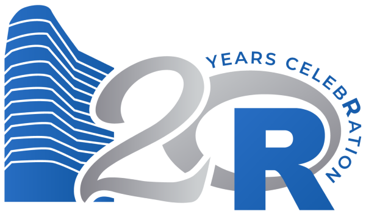

```{r setup, include=FALSE}
knitr::opts_chunk$set(echo = FALSE,cache=FALSE)
```

## Practical stuff

Two questionnaires: 

(1) Attendence 

(2) Survey on the meetings

<hr />

**Code of Conduct**

TL;DR: Be nice, be inclusive.

Full edition: https://github.com/au-cru/site/blob/master/CODE_OF_CONDUCT.md


## Celebration 2020

Celebrating 20 years with R!

February 28-29 in Copenhagen

http://celebration2020.org/


 


## Program for today

- **Per Møldrup-Dalum:** How we came to use R at the Royal Library — and what we use it for.
- **Stefan Høj-Edwards:** What's going on under the hood when you plot a ggplot2-plot.

<div class="smaller">
Snacks and refreshments sponsored by Kamstrup.


</div>